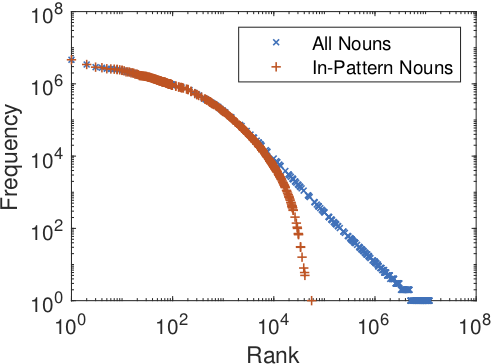
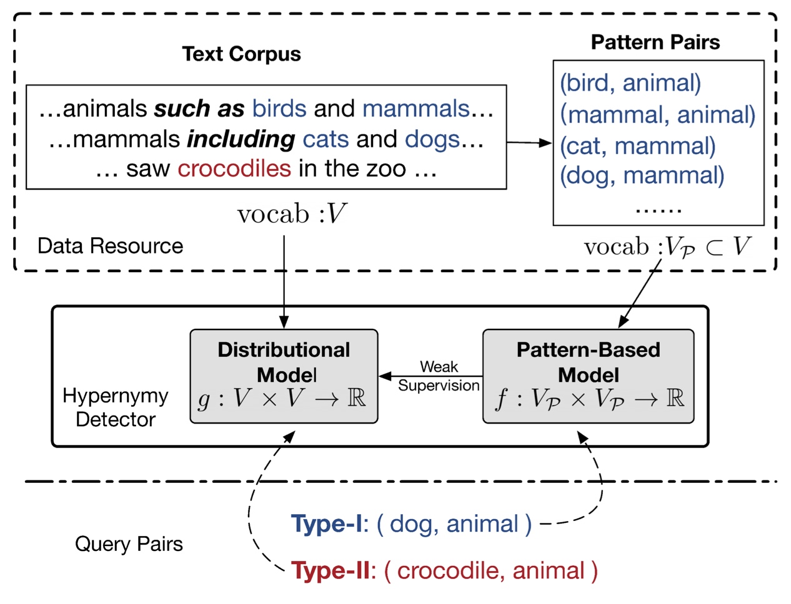

# ComHyper [](https://opensource.org/licenses/MIT)


Code for EMNLP'20 paper "When Hearst Is not Enough: Improving Hypernymy Detection from Corpus with Distributional Models" ([arXiv](https://arxiv.org/abs/2010.04941v1))


In a nutshell, ComHyper is the complementary framework for solving hypernymy detection tasks from the perspective of blind points of Hearst  pattern-based methods.  As shown in the left Figure,  long-tailed nouns cannot well covered by Hearst patterns and thus form non-negligible sparsity types.  For such cases, we propose to use supervised distributional models for complmenting pattern-based models shown in the right Figure. 

<p align="center"></p>


## Use ComHyper

### 1. Download Hearst pattern files and corpus.

First prepare the extracted Hearst pattern pairs such as `hearst_counts.txt.gz` from the repo [hypernymysuite](https://github.com/facebookresearch/hypernymysuite)  or `data-concept.zip` from Microsoft Concept Graph (Also known as [Probase](https://concept.research.microsoft.com/Home/Download)).  Specify the parameter `pattern_filename` in the `config` as the file location. 

```
wget https://github.com/facebookresearch/hypernymysuite/blob/master/hearst_counts.txt.gz
curl -L "https://concept.research.microsoft.com/Home/StartDownload" > data-concept.zip
```

Then extract the contexts for words from large-scale corpus such as Wiki + Gigaword or ukWac.  All the contexts for one word should be organized into one `txt` file and one line for one context.  

For those words appearing in the Hearst patterns (**IP words**),  organize their context files into the directory `context` in the `config`.  For **OOP words**,  organize their context files into the `context_oov`  in the `config`. 

### 2. Train and evaluate the ComHyper. 

For training the distributional models supervsied by the output of pattern-based models,  different context encoders are provided: 

```console
python train_word2score.py config/word.cfg
python train_context2score.py config/context.cfg
python train_bert2score.py config/bert.cfg
```

The same evaluation scripts work for all settings.  For reproducing the results, run: 

```console
python evaluation/evaluation_all_context.py ../config/context.cfg 
```

Note that we choose not to report the `BERT` encoder results in our orginial paper due to efficiency but release the relevant codes for incoroporating effective pre-trained contextualized encoders to further improve the performance. Welcome to PR or contact cyuaq # cse.ust.hk  ! 


## Citation

Please cite the following paper if you found our method helpful. Thanks !

```latex
@inproceedings{yu2020-comhyper,
   author = {Yu, Changlong and Han, Jialong and Wang, Peifeng and Song, Yangqiu and Zhang, Hongming and Ng, Wilfred and Shi, Shuming},
   booktitle = {Proceedings of the 2020 Conference on Empirical Methods in Natural Language Processing (EMNLP)},
   month = {Novemeber},
   title = {When Hearst Is not Enough: Improving Hypernymy Detection from Corpus with Distributional Models},
   year = {2020}
}
```


